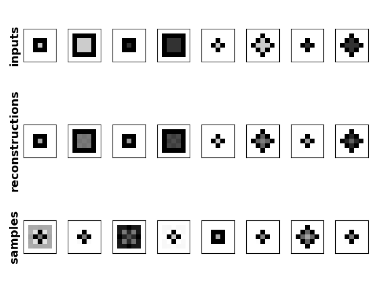

# PsyTorch

Some cognitive psychology models written with pytorch

## Dependencies

- numpy
- pytorch
- matplotlib (not essential; just for plotting)

## Usage

- everything's defined using the `class` structure common to pytorch models
  - see `_/barebones.py` for an example that doesn't invoke a python `class`
- get model outputs with `forward(...)`
- tried to use pytorch's built-in cost functions and optimizers when practical

## Models

- **multilayer perceptron** / classifier (`mlc.py`)
- **autoencoder** (`ae.py`)
- **variational autoencoder** (`vae.py`)
- **alcove** ([Krushke 1992](https://psych.indiana.edu/documents/kruschke-1992.pdf); `alcove.py`)
  - ^ missing a lot of key functionality of ALCOVE as a psychological model (like luce-choice, response mapping, humble-teacher principle, etc)
- Coming Soon:
  - DIVA ([Kurtz 2007](https://link.springer.com/content/pdf/10.3758/BF03196806.pdf))
  - variational DIVA

## Misc

Here's a fun example of a variational autoencoder trained on a very low-scale version of [SHJ](https://pdfs.semanticscholar.org/82ed/0991f22a31c1866ddc8d4aafe22fff9ac043.pdf)-style stimuli:

